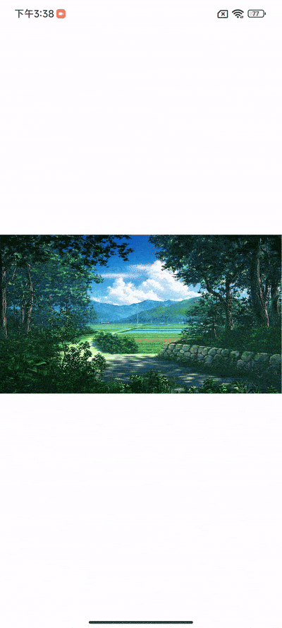

----

🖼 An image viewer for jetpack compose.

一款基于`Jetpack Compose`开发的图片浏览库，支持过渡变换和超大图片的显示

The latest version:  


### 🥳 1.1.0 全新版本～ `ImageViewer`现已更名为`Scale`

#### 📓 开发文档 👉 [DOCS](https://jvziyaoyao.github.io/scale)

#### 📝 更新日志 👉 [CHANGELOG](/CHANGELOG.md)

#### 👨‍💻 产品与开源 👉 [JVZIYAOYAO](https://www.jvziyaoyao.com)

<br/>

🌟 案例
--------
#### 📷 RawCamera 👉 [GITHUB](https://github.com/jvziyaoyao/raw-camera)

#### 🌆 ImagePicker 👉 [GITHUB](https://github.com/jvziyaoyao/ImagePicker)

👌 特性
--------
- 基于Jetpack Compose开发；
- 符合直觉的手势动效；
- 支持超大图片显示；
- 提供图片列表浏览组件；
- 支持图片弹出预览组件；
- 支持图片弹出预览的过渡动画；
- 支持定制化可扩展性高；
- 不依赖第三方图片库；

🧐 预览
--------
</img>
</img>

📓 API
--------
 💽 接口文档 👉 [API REFERENCE](https://jvziyaoyao.github.io/scale/reference)

👓 示例
--------
👋 示例代码请参考 👉 [SAMPLE](https://github.com/jvziyaoyao/scale/tree/dev/sample/src/main/java/com/jvziyaoyao/scale/sample)

🛒 引入
--------
Scale is available on `mavenCentral()`
```kotlin
// 使用MavenCentral仓库
repositories {
    mavenCentral()
}

val version = "1.1.0-alpha.5"
// 图片浏览库
implementation("com.jvziyaoyao.scale:image-viewer:$version")
// 大型图片支持
implementation("com.jvziyaoyao.scale:sampling-decoder:$version")
```

🛵 使用方式
--------

### 1️⃣ 缩放组件
```kotlin
val painter = painterResource(id = R.drawable.light_02)
val state = rememberZoomableState(contentSize = painter.intrinsicSize)
ZoomableView(state = state) {
    Image(
        modifier = Modifier.fillMaxSize(), // 这里请务必要充满整个图层
        painter = painter,
        contentDescription = null,
    )
}
```

### 2️⃣ 查看图片
</img>
```kotlin
val scope = rememberCoroutineScope()
val state = rememberZoomableState()
ImageViewer(
    state = state,
    model = painterResource(id = R.drawable.light_02),
    modifier = Modifier.fillMaxSize(),
    detectGesture = ZoomableGestureScope(onDoubleTap = {
        // 双击放大缩小
        scope.launch {
            state.toggleScale(it)
        }
    })
)
```

### 3️⃣ 加载超大图
</img>

添加`SamplingDecoder`依赖支持：
```kotlin
implementation("com.jvziyaoyao.scale:sampling-decoder:$version")
```

‼ 仅在`model`类型为`SamplingDecoder`才会被当做大图进行加载
```kotlin
val context = LocalContext.current
val scope = rememberCoroutineScope()
val inputStream = remember { context.assets.open("a350.jpg") }
val (samplingDecoder) = rememberSamplingDecoder(inputStream = inputStream)
if (samplingDecoder != null) {
    val state = rememberZoomableState(
        contentSize = samplingDecoder.intrinsicSize
    )
    ImageViewer(
        model = samplingDecoder,
        state = state,
        processor = ModelProcessor(samplingProcessorPair),
    )
}
```
### 4️⃣ 图片列表浏览
</img>
```kotlin
val images = remember {
    mutableStateListOf(
        R.drawable.light_01,
        R.drawable.light_02,
    )
}
ImagePager(
    modifier = Modifier.fillMaxSize(),
    pagerState = rememberZoomablePagerState { images.size },
    imageLoader = { index ->
        val painter = painterResource(images[index])
        return@ImagePager Pair(painter, painter.intrinsicSize)
    },
)
```
### 5️⃣ 图片弹出预览
</img>
```kotlin
val images = remember {
  listOf(
    R.drawable.img_01,
    R.drawable.img_02,
  )
}
val previewerState = rememberPreviewerState(pageCount = { images.size })
val scope = rememberCoroutineScope()
ImagePreviewer(
    state = previewerState,
    detectGesture = PagerGestureScope(onTap = {
        scope.launch {
            // 关闭预览组件
            previewerState.close()
        }
    }),
    imageLoader = { index ->
        val painter = painterResource(id = images[index])
        Pair(painter, painter.intrinsicSize)
    }
)

// 显示预览组件
previewerState.open()
```

### 6️⃣ 图片弹出预览（带转换效果）
</img>
```kotlin
val images = remember {
    listOf(
        // 依次声明图片的key、缩略图、原图（实际情况按实际情况来，这里只是示例）
        Triple("001", R.drawable.thumb_01, R.drawable.img_01),
        Triple("002", R.drawable.thumb_02, R.drawable.img_02),
    )
}
// 为组件提供获取数据长度和获取key的方法
val previewerState = rememberPreviewerState(
    pageCount = { images.size },
    getKey = { images[it].first }
)
// 显示缩略图小图的示例代码
val index = 1
val scope = rememberCoroutineScope()
TransformImageView(
    modifier = Modifier
        .size(120.dp)
        .clickable {
            scope.launch {
                // 点击事件触发动效
                previewerState.enterTransform(index)
            }
        },
    imageLoader = {
        val key = images[index].first
        val imageDrawableId = images[index].second
        val painter = painterResource(id = imageDrawableId) // 这里使用的是缩略图
        // 必须依次返回key、图片数据、图片的尺寸
        Triple(key, painter, painter.intrinsicSize)
    },
    transformState = previewerState,
)
// 这里声明图片预览组件
ImagePreviewer(
    state = previewerState,
    detectGesture = PagerGestureScope(onTap = {
        scope.launch {
            // 点击界面后关闭组件
            previewerState.exitTransform()
        }
    }),
    imageLoader = {
        val painter = painterResource(id = images[it].third) // 这里使用的是原图
        // 这里必须依次返回图片数据、图片的尺寸
        return@ImagePreviewer Pair(painter, painter.intrinsicSize)
    }
)
```

🕵️‍♀️ 开源许可
--------
Copyright 2022 jvziyaoyao

Licensed under the Apache License, Version 2.0 (the "License");
you may not use this file except in compliance with the License.
You may obtain a copy of the License at

       http://www.apache.org/licenses/LICENSE-2.0

Unless required by applicable law or agreed to in writing, software
distributed under the License is distributed on an "AS IS" BASIS,
WITHOUT WARRANTIES OR CONDITIONS OF ANY KIND, either express or implied.
See the License for the specific language governing permissions and
limitations under the License.
